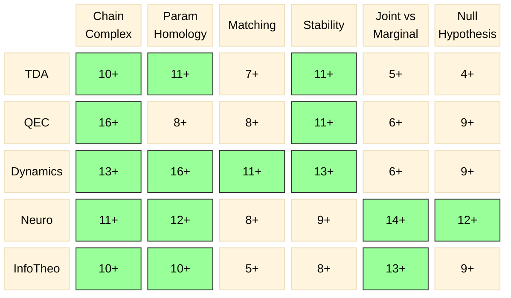

# Coverage Matrix — 6 Machines × 5 Domains

Updated: 2026-04-17 (Wave 10)

## Paper Counts

```
              Chain    Param   Match   Stabil  Joint   Null
              Complex  Homol           ity     v Marg  Hyp
─────────────────────────────────────────────────────────────
TDA           10+      11+      7+    11+      5+      4+
QEC           16+       8+      8+    11+      6+      9+
Dynamics      13+      16+     11+    13+      6+      9+
Neuro         11+      12+      8+     9+     14+     12+
InfoTheo      10+      10+      5+     8+     13+      9+
```

## Mermaid Heatmap



## Legend

- **Green cells** (≥10): Deep coverage — multiple independent instantiations documented
- **All other cells** (4–9): Adequate coverage
- All 30 cells now ≥ 4 (no thin cells remain)

## Key Changes (Wave 10)

- **Wave 10a** (5 papers): Baudot TIDA, Ghorbanchian sync, Dey Conley-Morse, Petri scaffolds, Chaudhuri ring attractor
- **Wave 10b** (5 papers): Chung density-void, Dabaghian template, Donato phase transitions, Batko Conley sampled, Panaretos Wasserstein
- **Wave 10c** (5 papers): Lord scaffolds (neuro), Jost-Zhang Cheeger (TDA), Trinca n-D toric (QEC), Curry DMT (TDA), Méndez directed PH (TDA)
- 16 green cells (≥10) — up from 8 in Session 7
- Chain Complex now ≥10 in ALL 5 domains; Param Homology ≥10 in 4/5
- Stability taxonomy expanded to 7 flavors (added: dimensional)

## Coverage Status

All 30 cells ≥ 4. 16 cells ≥ 10. ~219 unique papers.
