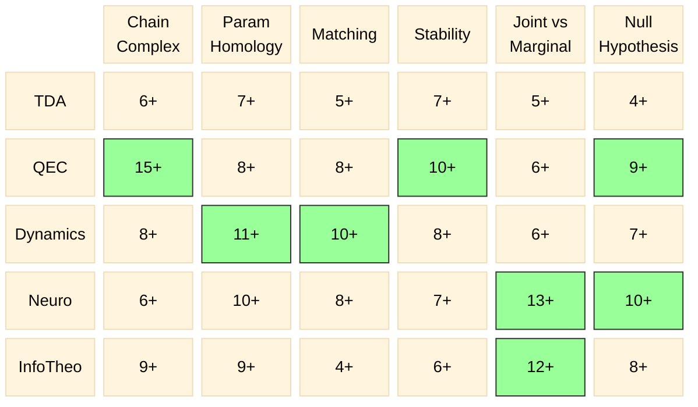

# Coverage Matrix — 6 Machines × 5 Domains

Updated: 2026-04-07 (Session 6)

## Paper Counts

```
              Chain    Param   Match   Stabil  Joint   Null
              Complex  Homol           ity     v Marg  Hyp
─────────────────────────────────────────────────────────────
TDA            6+       7+      5+     7+      5+      4+
QEC           15+       8+      8+    10+      6+      9+
Dynamics       8+      11+     10+     8+      6+      7+
Neuro          6+      10+      8+     7+     13+     10+
InfoTheo       9+       9+      4+     6+     12+      8+
```

## Mermaid Heatmap



## Legend

- **Green cells** (≥10): Deep coverage — multiple independent instantiations documented
- **All other cells** (4–9): Adequate coverage
- All 30 cells now ≥ 4 (no thin cells remain)

## Key Changes (Session 6)

- **Match×TDA**: ~3 → **5+** (added Bubenik & Elchesen 2019, Chen & Wang 2021)
- **Match×InfoTheo**: ~3 → **4+** (added Blahut 1972 / Arimoto 1972)

## Coverage Status

All 30 cells now ≥ 4. No remaining thin cells. The matrix is fully covered.
