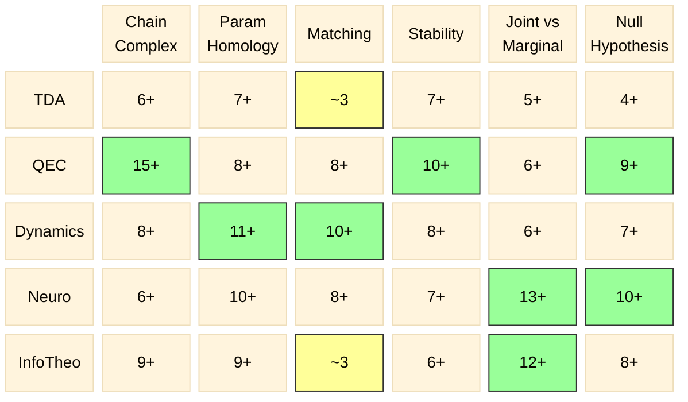

# Coverage Matrix — 6 Machines × 5 Domains

Updated: 2026-04-07 (Session 5)

## Paper Counts

```
              Chain    Param   Match   Stabil  Joint   Null
              Complex  Homol           ity     v Marg  Hyp
─────────────────────────────────────────────────────────────
TDA            6+       7+     ~3      7+      5+      4+
QEC           15+       8+      8+    10+      6+      9+
Dynamics       8+      11+     10+     8+      6+      7+
Neuro          6+      10+      8+     7+     13+     10+
InfoTheo       9+       9+     ~3      6+     12+      8+
```

## Mermaid Heatmap



## Legend

- **Green cells** (≥10): Deep coverage — multiple independent instantiations documented
- **Yellow cells** (~3): Thin coverage — genuine papers exist but cell is inherently sparse
- **All other cells** (4–9): Adequate coverage

## Key Changes (Session 5)

- **Joint×TDA**: ~2 → **5+** (added Varley 2025, Hamilton & Leditzky 2024, Natarajan 2026)
- **Joint×QEC**: 5+ → **6+** (Hamilton & Leditzky cross-listed)
- **Joint×InfoTheo**: 12+ → **12+** (Rosas 2020 added, count already high)

## Remaining Thin Cells

- **Match×TDA (~3)**: Di Rocco, Divol-Lacombe, Adams. Matching is inherently less prevalent in TDA.
- **Match×InfoTheo (~3)**: Mézard-Mora, Wong-Yang, Kolchinsky. Matching is not a natural info-theory operation.

These cells may not need more papers — the thinness reflects genuine domain structure rather than search gaps.
