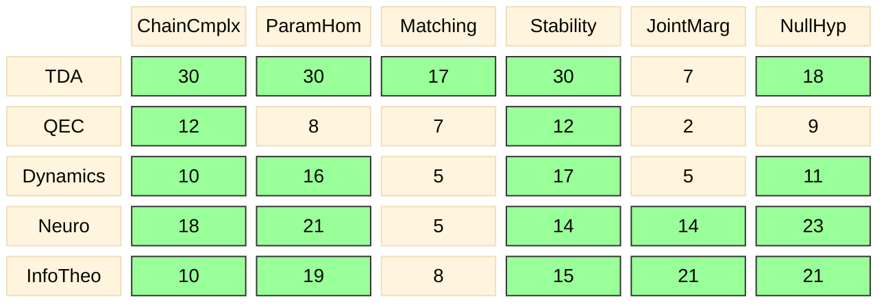

# Coverage Matrix — 6 Machines × 5 Domains

Updated: 2026-08-24 (derived by scripts/gen_stats.py from papers/annotations/)

## Paper Counts

```
                ChainCmplx    ParamHom    Matching   Stability   JointMarg     NullHyp
──────────────────────────────────────────────────────────────────────────────────────
TDA                   *30*        *30*        *17*        *30*           7        *18*
QEC                   *12*           8           7        *12*           2           9
Dynamics              *10*        *16*           5        *17*           5        *11*
Neuro                 *18*        *21*           5        *14*        *14*        *23*
InfoTheo              *10*        *19*           8        *15*        *21*        *21*
```

(`*n*` marks deep cells ≥10.)

## Mermaid Heatmap


```mermaid
%%{init: {'theme': 'base', 'themeVariables': {'fontSize': '14px'}}}%%
block-beta
  columns 7

  space:1 CC["ChainCmplx"] PH["ParamHom"] MA["Matching"] ST["Stability"] JM["JointMarg"] NH["NullHyp"]

  TDA["TDA"] TDA_CC["30"] TDA_PH["30"] TDA_MA["17"] TDA_ST["30"] TDA_JM["7"] TDA_NH["18"]
  QEC["QEC"] QEC_CC["12"] QEC_PH["8"] QEC_MA["7"] QEC_ST["12"] QEC_JM["2"] QEC_NH["9"]
  DYN["Dynamics"] DYN_CC["10"] DYN_PH["16"] DYN_MA["5"] DYN_ST["17"] DYN_JM["5"] DYN_NH["11"]
  NEU["Neuro"] NEU_CC["18"] NEU_PH["21"] NEU_MA["5"] NEU_ST["14"] NEU_JM["14"] NEU_NH["23"]
  IT["InfoTheo"] IT_CC["10"] IT_PH["19"] IT_MA["8"] IT_ST["15"] IT_JM["21"] IT_NH["21"]
  style TDA_CC fill:#9f9,stroke:#333
  style TDA_PH fill:#9f9,stroke:#333
  style TDA_MA fill:#9f9,stroke:#333
  style TDA_ST fill:#9f9,stroke:#333
  style TDA_NH fill:#9f9,stroke:#333
  style QEC_CC fill:#9f9,stroke:#333
  style QEC_ST fill:#9f9,stroke:#333
  style DYN_CC fill:#9f9,stroke:#333
  style DYN_PH fill:#9f9,stroke:#333
  style DYN_ST fill:#9f9,stroke:#333
  style DYN_NH fill:#9f9,stroke:#333
  style NEU_CC fill:#9f9,stroke:#333
  style NEU_PH fill:#9f9,stroke:#333
  style NEU_ST fill:#9f9,stroke:#333
  style NEU_JM fill:#9f9,stroke:#333
  style NEU_NH fill:#9f9,stroke:#333
  style IT_CC fill:#9f9,stroke:#333
  style IT_PH fill:#9f9,stroke:#333
  style IT_ST fill:#9f9,stroke:#333
  style IT_JM fill:#9f9,stroke:#333
  style IT_NH fill:#9f9,stroke:#333
```

## Legend

- **Bold/green cells** (≥10): Deep coverage — multiple independent instantiations documented
- All other cells: Adequate coverage (<10)

Counts cover papers with full annotations under `papers/annotations/`
(one file per paper). Index stubs without a full annotation are not counted.
Regenerate with `python3 scripts/gen_stats.py`; `check_structure.py --check`
fails if these numbers drift from the claims in README.md / docs/index.html.

## Coverage Status

86 fully annotated papers. 21 of 30 cells ≥10 (deep); min cell = 2.
