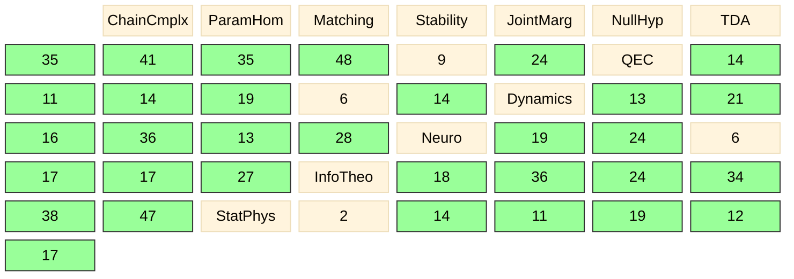

# Coverage Matrix — 6 Machines × 6 Domains

Updated: 2026-08-25 (derived by scripts/gen_stats.py from papers/annotations/)

## Paper Counts

```
                ChainCmplx    ParamHom    Matching   Stability   JointMarg     NullHyp
──────────────────────────────────────────────────────────────────────────────────────
TDA                   *35*        *41*        *35*        *48*           9        *24*
QEC                   *14*        *11*        *14*        *19*           6        *14*
Dynamics              *13*        *21*        *16*        *36*        *13*        *28*
Neuro                 *19*        *24*           6        *17*        *17*        *27*
InfoTheo              *18*        *36*        *24*        *34*        *38*        *47*
StatPhys                 2        *14*        *11*        *19*        *12*        *17*
```

(`*n*` marks deep cells ≥10.)

## Mermaid Heatmap


```mermaid
%%{init: {'theme': 'base', 'themeVariables': {'fontSize': '14px'}}}%%
block-beta
  columns 8

  space:1 CC["ChainCmplx"] PH["ParamHom"] MA["Matching"] ST["Stability"] JM["JointMarg"] NH["NullHyp"]

  TDA["TDA"] TDA_CC["35"] TDA_PH["41"] TDA_MA["35"] TDA_ST["48"] TDA_JM["9"] TDA_NH["24"]
  QEC["QEC"] QEC_CC["14"] QEC_PH["11"] QEC_MA["14"] QEC_ST["19"] QEC_JM["6"] QEC_NH["14"]
  DYN["Dynamics"] DYN_CC["13"] DYN_PH["21"] DYN_MA["16"] DYN_ST["36"] DYN_JM["13"] DYN_NH["28"]
  NEU["Neuro"] NEU_CC["19"] NEU_PH["24"] NEU_MA["6"] NEU_ST["17"] NEU_JM["17"] NEU_NH["27"]
  IT["InfoTheo"] IT_CC["18"] IT_PH["36"] IT_MA["24"] IT_ST["34"] IT_JM["38"] IT_NH["47"]
  SP["StatPhys"] SP_CC["2"] SP_PH["14"] SP_MA["11"] SP_ST["19"] SP_JM["12"] SP_NH["17"]
  style TDA_CC fill:#9f9,stroke:#333
  style TDA_PH fill:#9f9,stroke:#333
  style TDA_MA fill:#9f9,stroke:#333
  style TDA_ST fill:#9f9,stroke:#333
  style TDA_NH fill:#9f9,stroke:#333
  style QEC_CC fill:#9f9,stroke:#333
  style QEC_PH fill:#9f9,stroke:#333
  style QEC_MA fill:#9f9,stroke:#333
  style QEC_ST fill:#9f9,stroke:#333
  style QEC_NH fill:#9f9,stroke:#333
  style DYN_CC fill:#9f9,stroke:#333
  style DYN_PH fill:#9f9,stroke:#333
  style DYN_MA fill:#9f9,stroke:#333
  style DYN_ST fill:#9f9,stroke:#333
  style DYN_JM fill:#9f9,stroke:#333
  style DYN_NH fill:#9f9,stroke:#333
  style NEU_CC fill:#9f9,stroke:#333
  style NEU_PH fill:#9f9,stroke:#333
  style NEU_ST fill:#9f9,stroke:#333
  style NEU_JM fill:#9f9,stroke:#333
  style NEU_NH fill:#9f9,stroke:#333
  style IT_CC fill:#9f9,stroke:#333
  style IT_PH fill:#9f9,stroke:#333
  style IT_MA fill:#9f9,stroke:#333
  style IT_ST fill:#9f9,stroke:#333
  style IT_JM fill:#9f9,stroke:#333
  style IT_NH fill:#9f9,stroke:#333
  style SP_PH fill:#9f9,stroke:#333
  style SP_MA fill:#9f9,stroke:#333
  style SP_ST fill:#9f9,stroke:#333
  style SP_JM fill:#9f9,stroke:#333
  style SP_NH fill:#9f9,stroke:#333
```

## Legend

- **Bold/green cells** (≥10): Deep coverage — multiple independent instantiations documented
- All other cells: Adequate coverage (<10)

Counts cover papers with full annotations under `papers/annotations/`
(one file per paper). Index stubs without a full annotation are not counted.
Regenerate with `python3 scripts/gen_stats.py`; `check_structure.py --check`
fails if these numbers drift from the claims in README.md / docs/index.html.

## Coverage Status

164 fully annotated papers. 32 of 36 cells ≥10 (deep); min cell = 2.
