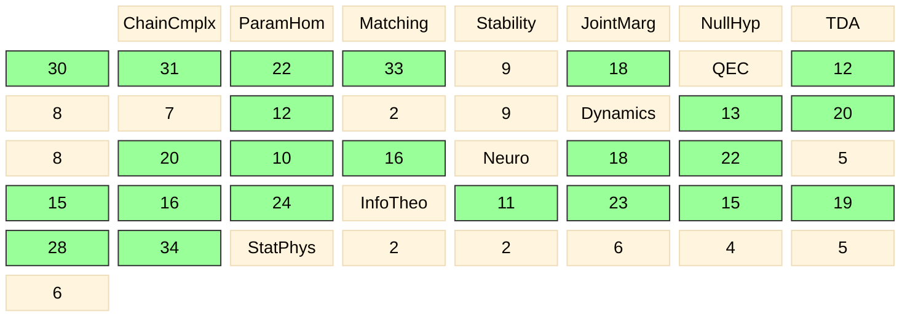

# Coverage Matrix — 6 Machines × 6 Domains

Updated: 2026-08-25 (derived by scripts/gen_stats.py from papers/annotations/)

## Paper Counts

```
                ChainCmplx    ParamHom    Matching   Stability   JointMarg     NullHyp
──────────────────────────────────────────────────────────────────────────────────────
TDA                   *30*        *31*        *22*        *33*           9        *18*
QEC                   *12*           8           7        *12*           2           9
Dynamics              *13*        *20*           8        *20*        *10*        *16*
Neuro                 *18*        *22*           5        *15*        *16*        *24*
InfoTheo              *11*        *23*        *15*        *19*        *28*        *34*
StatPhys                 2           2           6           4           5           6
```

(`*n*` marks deep cells ≥10.)

## Mermaid Heatmap


```mermaid
%%{init: {'theme': 'base', 'themeVariables': {'fontSize': '14px'}}}%%
block-beta
  columns 8

  space:1 CC["ChainCmplx"] PH["ParamHom"] MA["Matching"] ST["Stability"] JM["JointMarg"] NH["NullHyp"]

  TDA["TDA"] TDA_CC["30"] TDA_PH["31"] TDA_MA["22"] TDA_ST["33"] TDA_JM["9"] TDA_NH["18"]
  QEC["QEC"] QEC_CC["12"] QEC_PH["8"] QEC_MA["7"] QEC_ST["12"] QEC_JM["2"] QEC_NH["9"]
  DYN["Dynamics"] DYN_CC["13"] DYN_PH["20"] DYN_MA["8"] DYN_ST["20"] DYN_JM["10"] DYN_NH["16"]
  NEU["Neuro"] NEU_CC["18"] NEU_PH["22"] NEU_MA["5"] NEU_ST["15"] NEU_JM["16"] NEU_NH["24"]
  IT["InfoTheo"] IT_CC["11"] IT_PH["23"] IT_MA["15"] IT_ST["19"] IT_JM["28"] IT_NH["34"]
  SP["StatPhys"] SP_CC["2"] SP_PH["2"] SP_MA["6"] SP_ST["4"] SP_JM["5"] SP_NH["6"]
  style TDA_CC fill:#9f9,stroke:#333
  style TDA_PH fill:#9f9,stroke:#333
  style TDA_MA fill:#9f9,stroke:#333
  style TDA_ST fill:#9f9,stroke:#333
  style TDA_NH fill:#9f9,stroke:#333
  style QEC_CC fill:#9f9,stroke:#333
  style QEC_ST fill:#9f9,stroke:#333
  style DYN_CC fill:#9f9,stroke:#333
  style DYN_PH fill:#9f9,stroke:#333
  style DYN_ST fill:#9f9,stroke:#333
  style DYN_JM fill:#9f9,stroke:#333
  style DYN_NH fill:#9f9,stroke:#333
  style NEU_CC fill:#9f9,stroke:#333
  style NEU_PH fill:#9f9,stroke:#333
  style NEU_ST fill:#9f9,stroke:#333
  style NEU_JM fill:#9f9,stroke:#333
  style NEU_NH fill:#9f9,stroke:#333
  style IT_CC fill:#9f9,stroke:#333
  style IT_PH fill:#9f9,stroke:#333
  style IT_MA fill:#9f9,stroke:#333
  style IT_ST fill:#9f9,stroke:#333
  style IT_JM fill:#9f9,stroke:#333
  style IT_NH fill:#9f9,stroke:#333
```

## Legend

- **Bold/green cells** (≥10): Deep coverage — multiple independent instantiations documented
- All other cells: Adequate coverage (<10)

Counts cover papers with full annotations under `papers/annotations/`
(one file per paper). Index stubs without a full annotation are not counted.
Regenerate with `python3 scripts/gen_stats.py`; `check_structure.py --check`
fails if these numbers drift from the claims in README.md / docs/index.html.

## Coverage Status

104 fully annotated papers. 23 of 36 cells ≥10 (deep); min cell = 2.
